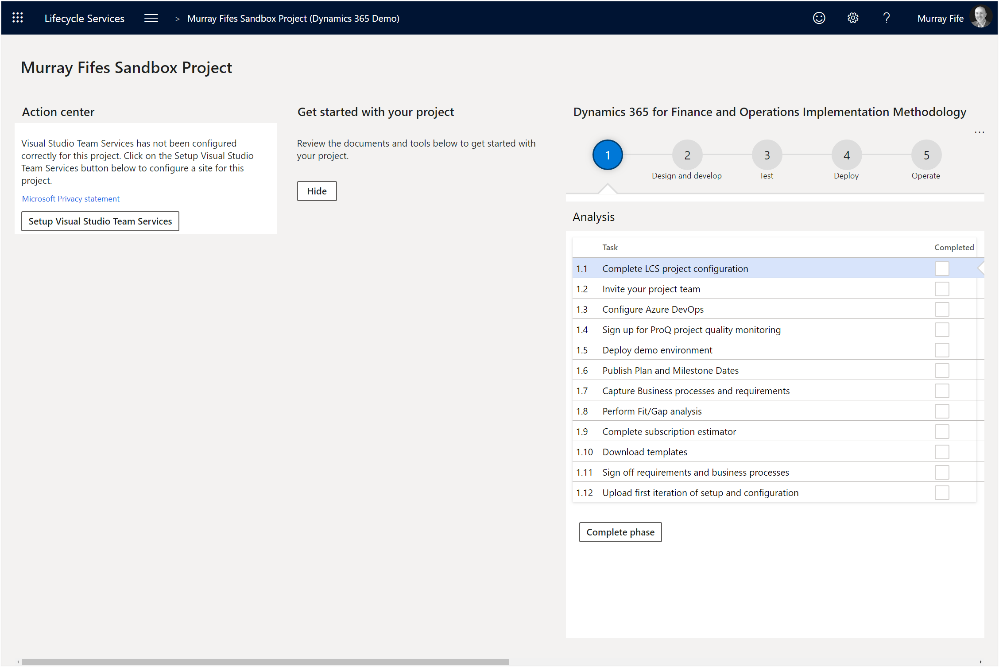
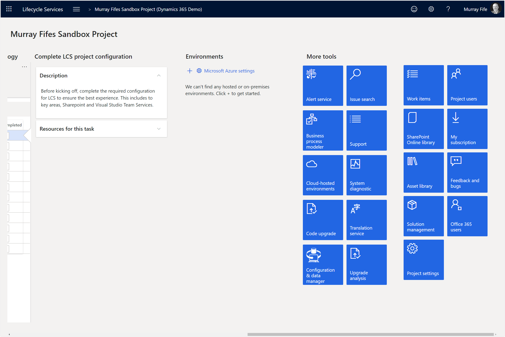
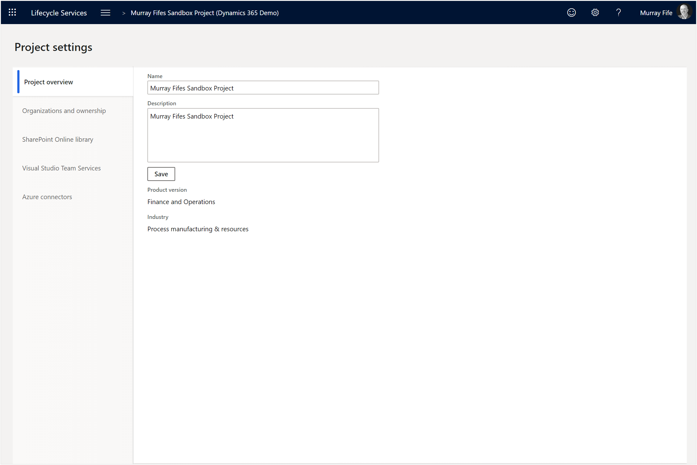
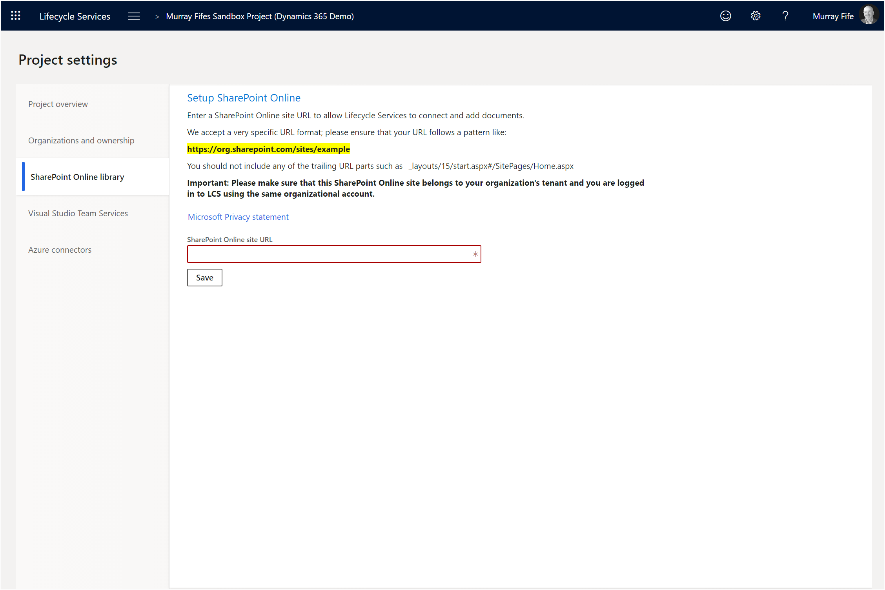
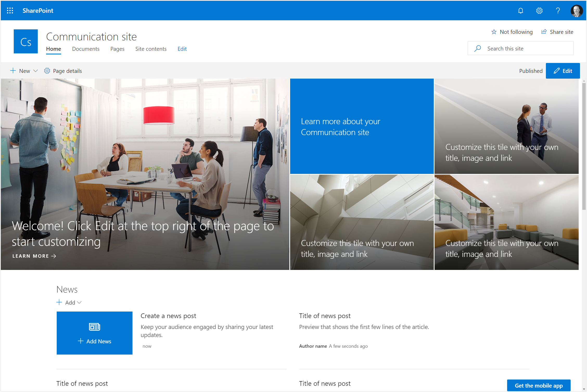
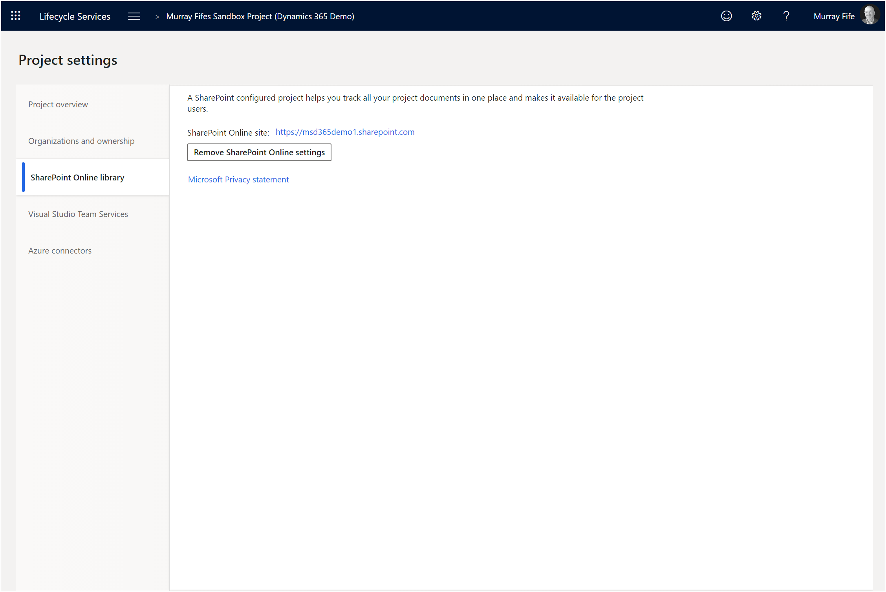
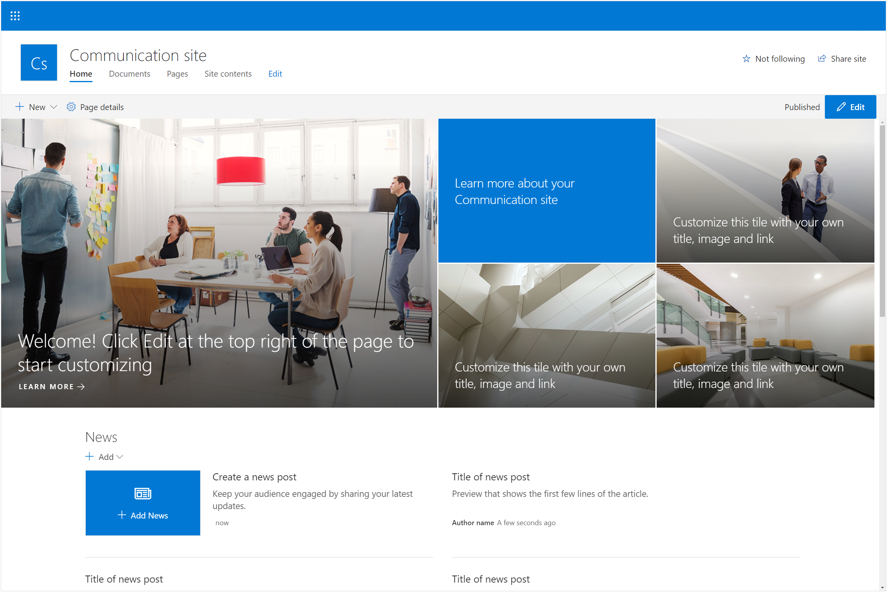

# Configuring SharePoint Integration for Lifecycle Services
The next area that we will polish up will be Lifecycle Services where we will be able to highlight all the project resources that are available for Dynamics 365 Finance & Supply Chain Management.  There are several different tweaks that we will want to make here.
By default, Lifecycle Services does not allow us to save any documents to the site, but it will allow us to save the documents to a SharePoint site of our choosing.
So, the first one that we will start off with is to link our Lifecycle Services project with SharePoint so that we can save our project documents.

## How to do it…

Let’s return to our Lifecycle Services project that we just created so that we can make some more configuration changes to the project.

### Step 1: Click on the Project settings button
Scroll over to the right of the projects workspace so that we can see the New tools tiles.
This will let us access the project settings for our project.
To do this just click on the Project settings button.

### Step 2: Click the SharePoint Online library tab
This will open the Project settings page.
From here we will be able to update a lot of the project information, including the SharePoint configuration details.
To do this all we need to do is click the SharePoint Online library tab.

### Step 3: Click on the SharePoint Online library tab
This will open the Project settings form for our project.
From here we will be able to update a lot of the project information, including the SharePoint configuration details.
To do this all we need to do is click on the SharePoint Online library tab.
This tab will give us the option to enter in a SharePoint Online site URL which will link the Lifecycle Services project to SharePoint for document management.

All we need to do is to find the URL for our tenants SharePoint site.
To find the URL that we need all you need to do is to open your SharePoint team site for the tenant that you have connected to your Dynamics 365 instance and copy the base URL from the address.
Usually this will just be your tenants prefix followed by .sharepoint.com.
For our example, we just navigated to msd365demo1.sharepoint.com.
Once you have found the right URL for our tenants SharePoint site, note it down for the next step.

### Step 4: Update the SharePoint Online site URL and click Save
Now we can return to the Project settings for our Lifecycle Services project and update the URL for the SharePoint site and save the changes.
To do this just update the SharePoint Online site URL value and click on the Save button.
This time, we will want to set the SharePoint Online site URL to https://msd365demo1.sharepoint.com.  Remember that you will want to use your demo tenants SharePoint URL.

### Step 5: Click on the https://msd365demo1.onmicrosoft.com link
The SharePoint options will now be linked with your SharePoint library.
We can test the connection if we like directly from this form.
To do this just click on the https://msd365demo1.onmicrosoft.com link.

This will open the tenants team site for us and validate that we have the correct connection with SharePoint.

## Summary

Now we have connected our Lifecycle Services project with our SharePoint document repository.
This allows us to show how the project documents may be stored within SharePoint directly from the projects project methodology.  This is a great way to manage the projects documentation, milestones and deliverables all in one place, and utilize the Office 365 capabilities seamlessly within Lifecycle Services.

