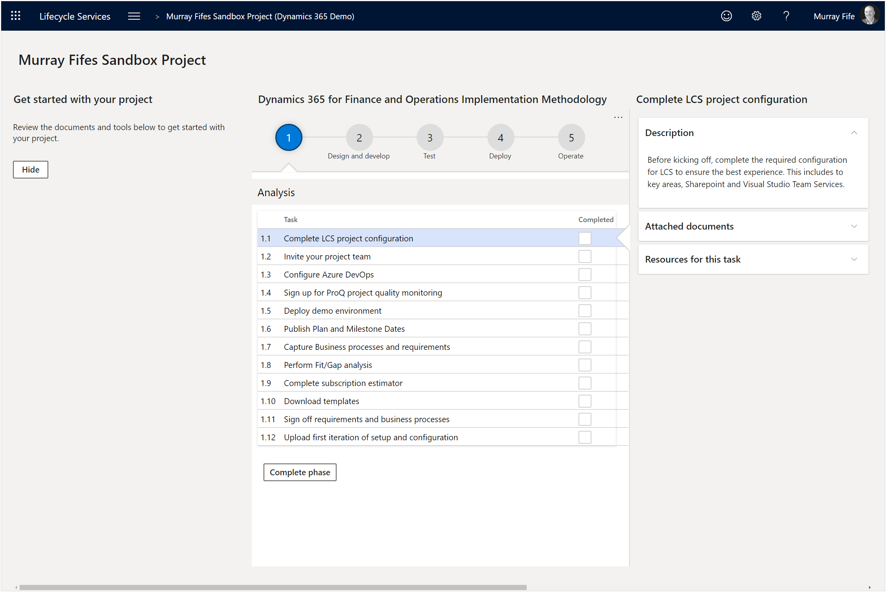
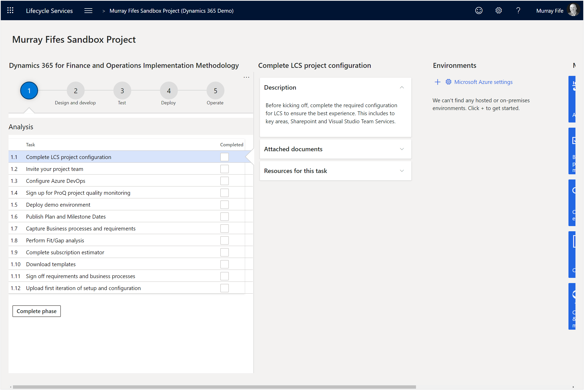

# Dismissing the Getting Started reminders
When you initially start up Lifecycle Services, it will give you a couple of tips on getting started with the project.  Although these are nice the first time you see them, they aren’t that necessary after a while.  So to declutter the dashboard we will probably want to hide the tips.

## How to do it…

### Step 1: Click on the Hide button
Within our project we will see that there are some reminders within the Getting started with your project section.
We can dismiss these to make the workspace look tidier.
To do this all we need to do is click on the Hide button.

## Summary

That will hide the column and just show you what you need to see.
Now you have a clean Lifecycle Services project without any of the extra chatter that it initially throws at you.

