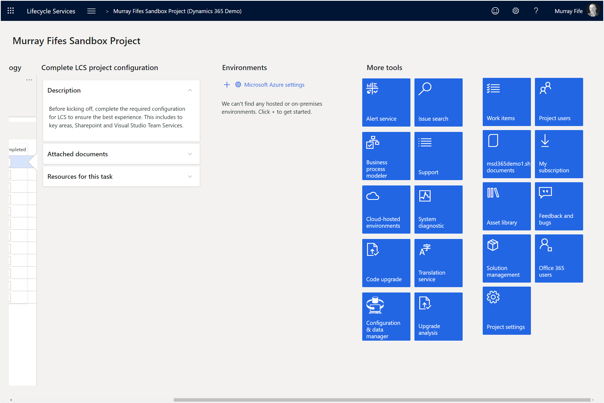
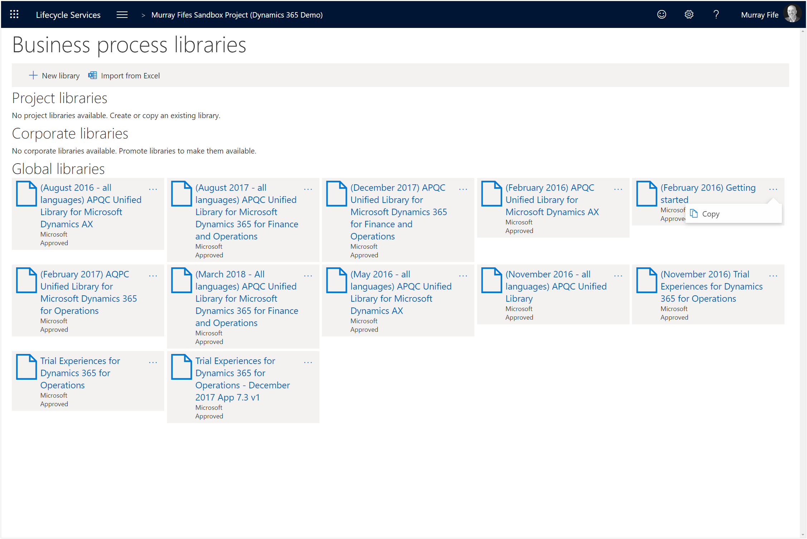
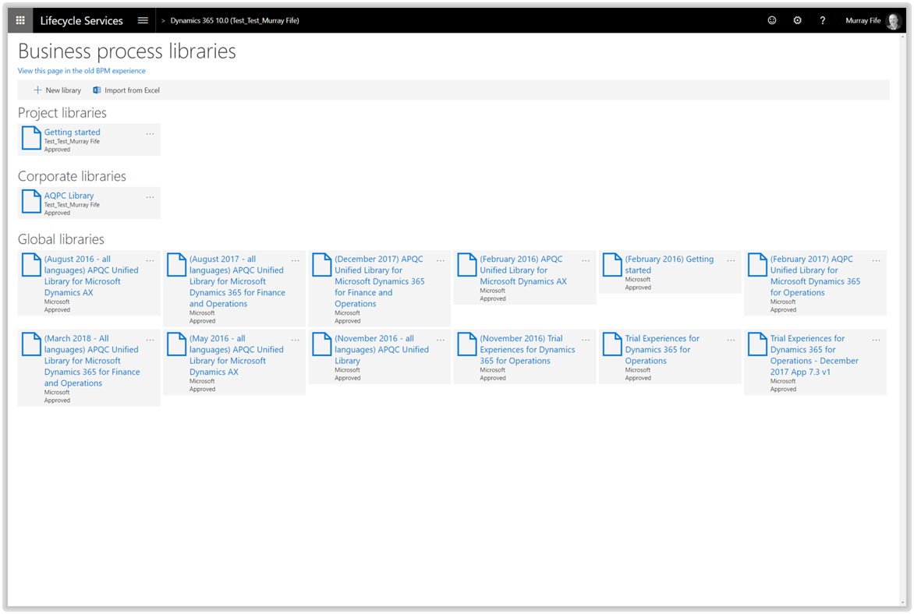
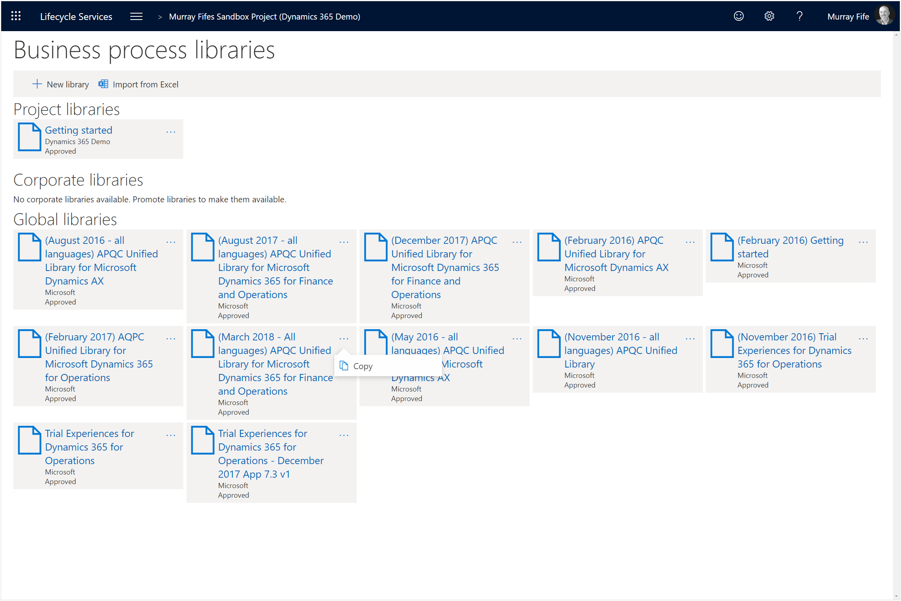
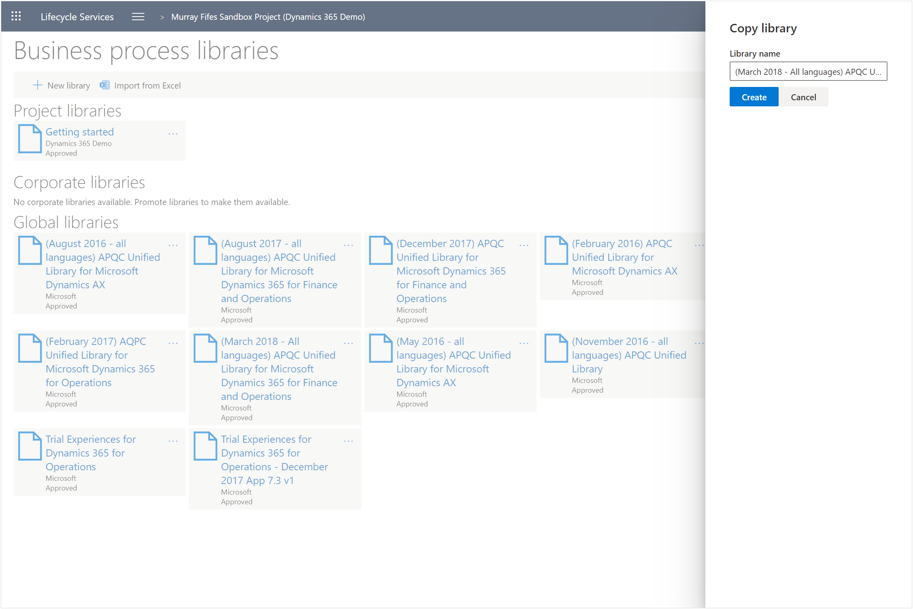
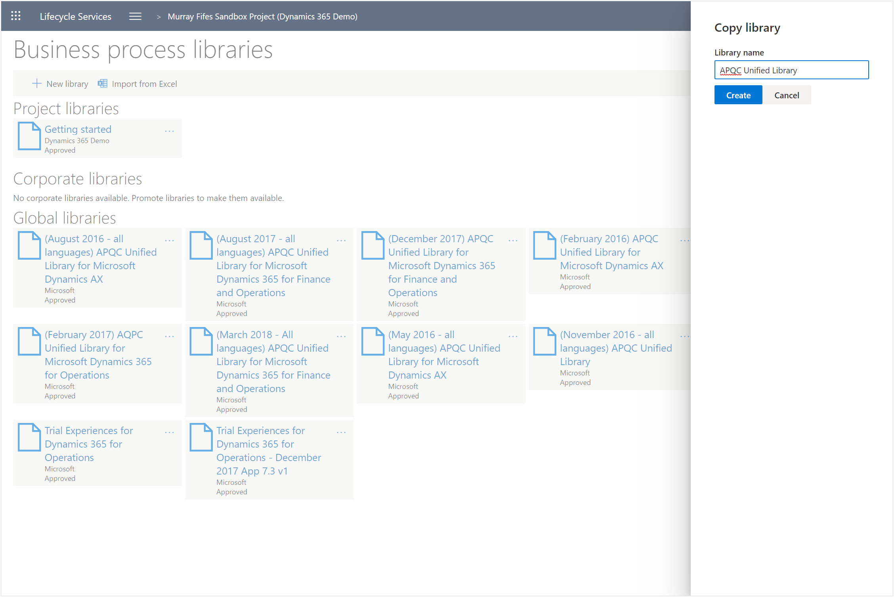
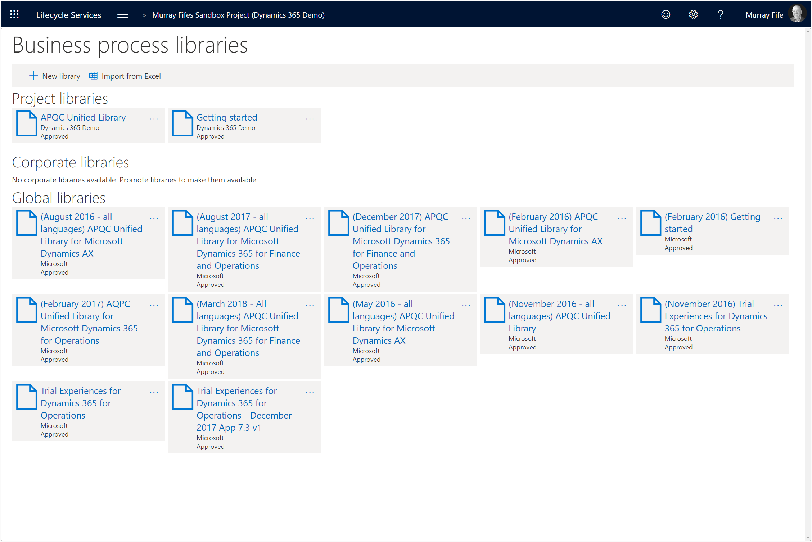
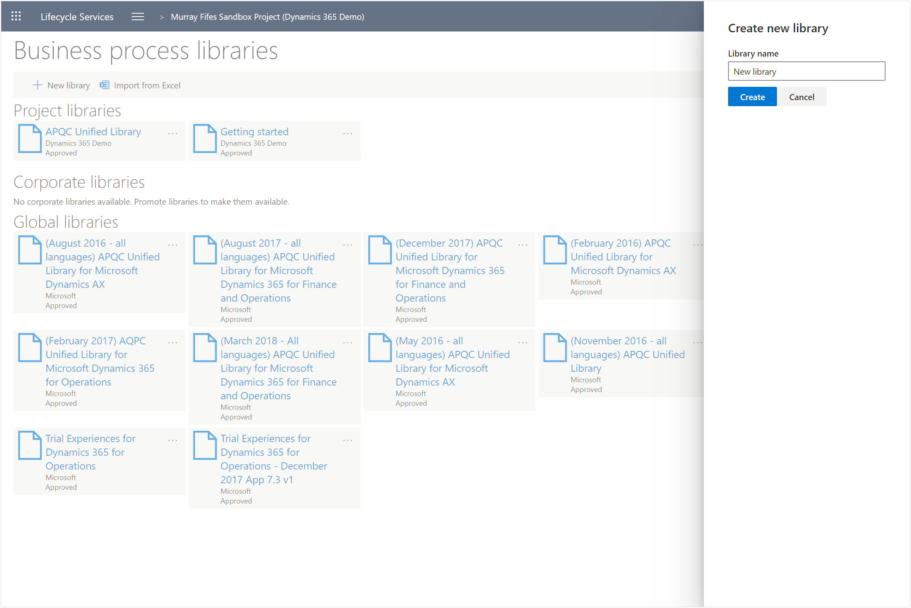
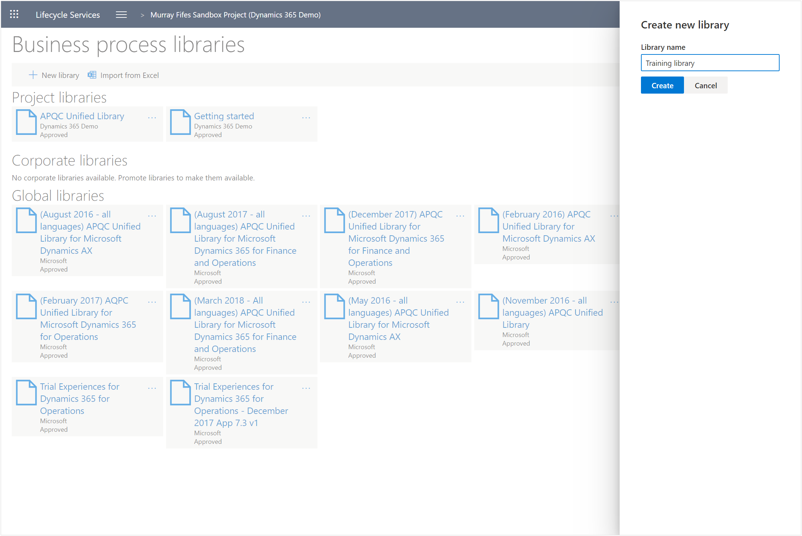
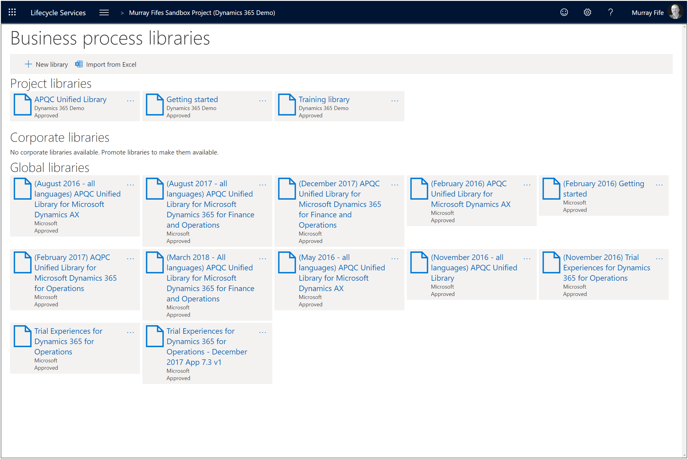

# Configuring the Business Process Models within Lifecycle Services
One of the key resources for Dynamics 365 within Lifecycle Services are the Business Process Models.  These allow you to see how business processes should work, they are a repository for all of your new & updated business processes, and most importantly they are where all of the Task Guides are stored for Dynamics 365 to reference.
When you first create your Lifecycle Services project there are global libraries that you can reference but they are locked and read only.
To make the most out of the Business Process Libraries we will want to create some new versions of the libraries that we are able to modify and extend for our own project.

## How to do it…

### Step 1: Click on the Business process modeler button
To do this we will start off by opening up Lifecycle Services and then scroll over to the right until we can see the More Tools tiles.  
There will be a tile there for Business Process Models which we will want to click on.
To do this all we need to do is click on the Business process modeler button.

This will open the Business process libraries.
We will see that there are a couple of default libraries within the Global libraries section. 

### Step 2: Click on the ... button and click on the Copy button
We will want to promote these libraries over to the My libraries section so that we can manipulate them.
Rather than building a business process model from a blank template, we can use the ones that are in the Global library as a template for our business process models.
To do this just click on the ... Button for the Getting Started library and click on the Copy button.

This will open the Copy library dialog box.

### Step 3: Update the Library name and click on the Create button
All we need to do here is enter in a Library Name.  
In this example we just want to type in Getting Started as the name.  By not adding the same name from the global library it will be easier to identify our library from the global one.
To do this just change the Library name value and click on the Create button.
This time, we will want to set the Library name to Getting started.

This will create a new Business Process library within our Project libraries section.

### Step 4: Click on the ... button and click on the Copy button
Next we will want to create a copy of the APQC library.
We will create the library just the same way that we did for the Getting started library.
To do this all we need to do is click on the ... button for the APQC library and click on the Copy button.

This will open the Copy library dialog box.

### Step 5: Update the Library name and click on the Create button
We will want to change the name of the library to something a little less verbose and then create the library.
To do this just change the Library name value and click on the Create button.
This time, we will want to set the Library name to APQC Unified Library.

This will create a second library for us with all of the APQC default business processes. 

### Step 6: Click on the New library button
We will create one more library, but this time we will just create a blank library that we can use to put all of our training task guides within.
To do this just click on the New library button.

This will open the Create library panel for our new blank library.

### Step 7: Update the Library name and click on the Create button
We will want to give our third library a name and then create the library.
To do this just change the Library name value and click on the Create button.
This time, we will want to set the Library name to Training Library.

Now we will have a third library that we can use as reference for Dynamics 365.
Just as a side note, the create option will create an empty library based off the library that you choose without any business processes allowing us to create our own.  We use the Getting Started library because if we used the APQC library then there would be an APQC logo in the new library which we don’t want.

## Summary

Now we have created some libraries that we can use within Dynamics 365.  We have the Getting started library, the standard library with all of the default business flows, and a third library which we will be able to populate with training guides for our users.

