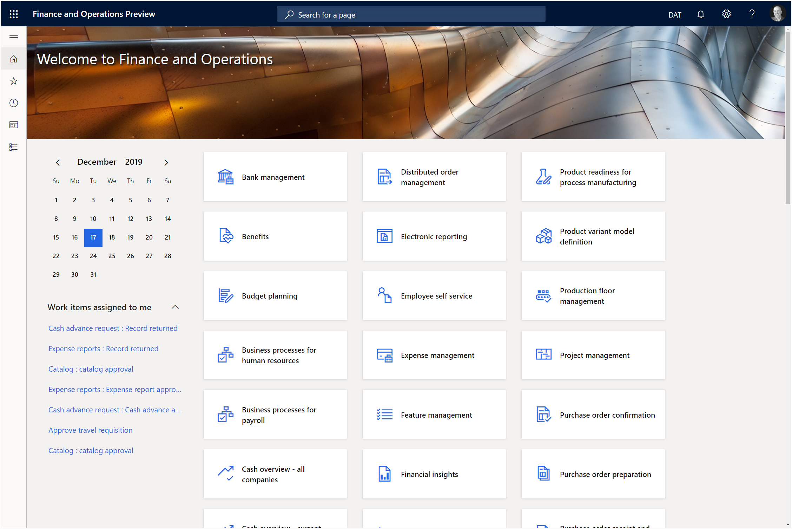
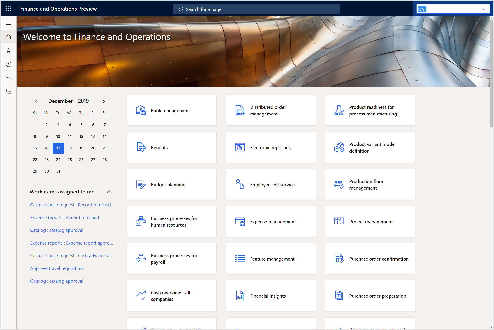
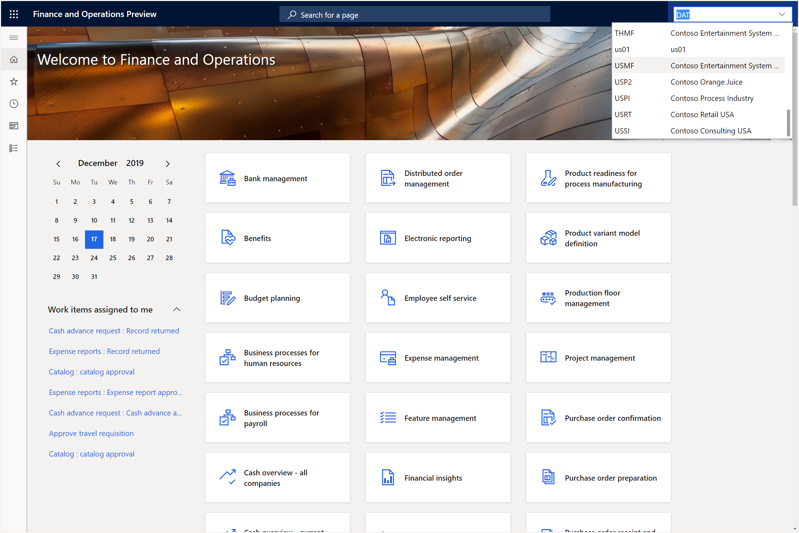

# Changing the default Company
There is one quick tweak that we will want to make to the system at this point and that is to connect to the right company.  By default, when you first start up Dynamics 365 it will default to the DAT company which is the global company.  We want to change this to one that has data in it.

## How to do it…

You can do these two different ways now that you have the user defaults configured.  You can either log out and log back in again, or you can just click on the Company dropdown list in the title bar and find the company that you want to use and then select it.
For example, in our example we want to set the default demo company to USMF.

After we have changed the company then the banner image will change to show us that we are in the right legal entity and we are done.

Now that we are logged into the right company we can start working on the more exciting integration points within Dynamics 365.

