# Replacing the Default Admin Worker with your Worker
Once we have a worker record created we can then replace the worker that is associated with the Admin user with our own worker account.

## How to do it…

To do this type in users into the search field at the top of the page and Dynamics 365 will show you all of the menu items that match.  All you need to do here is find the System Users menu item and click on it.

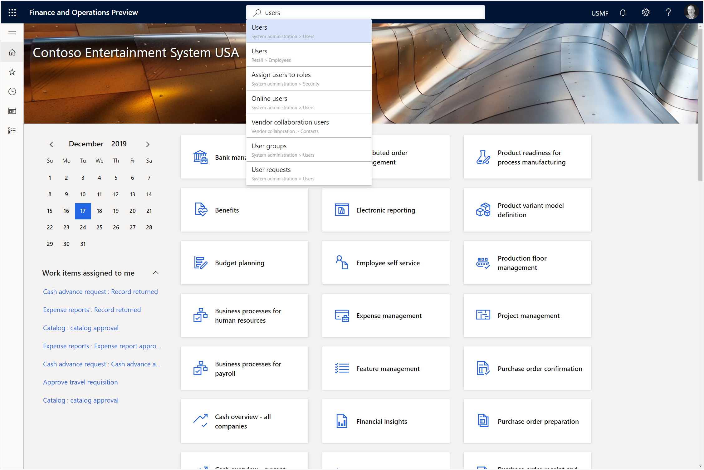

This will open the Users list page and all we need to do here is click on the Admin user.

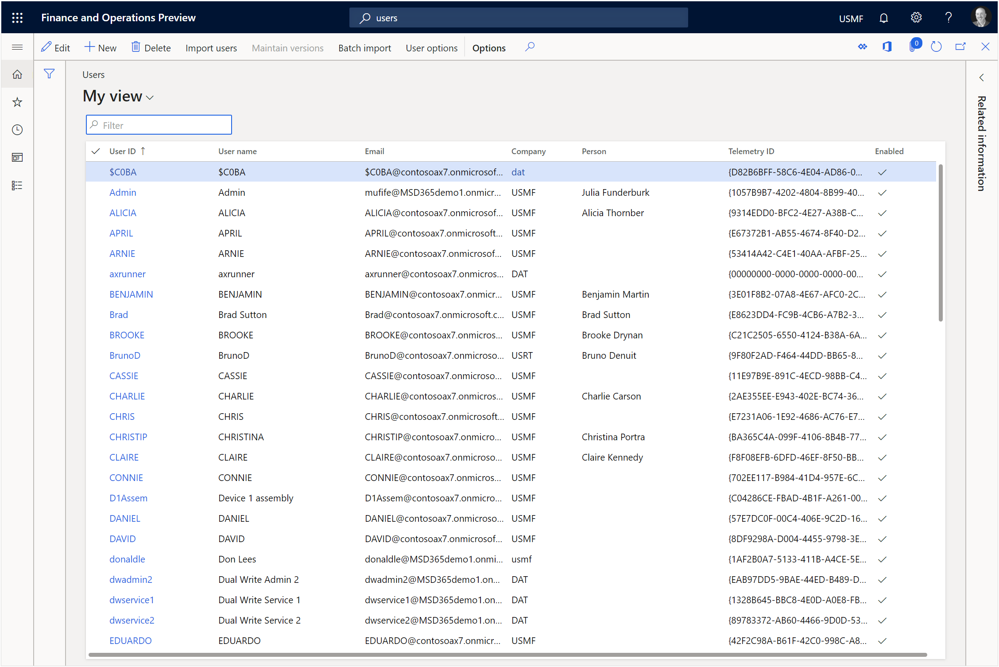

To edit the information for the Admin user account then all we need to do is click on the Edit button.

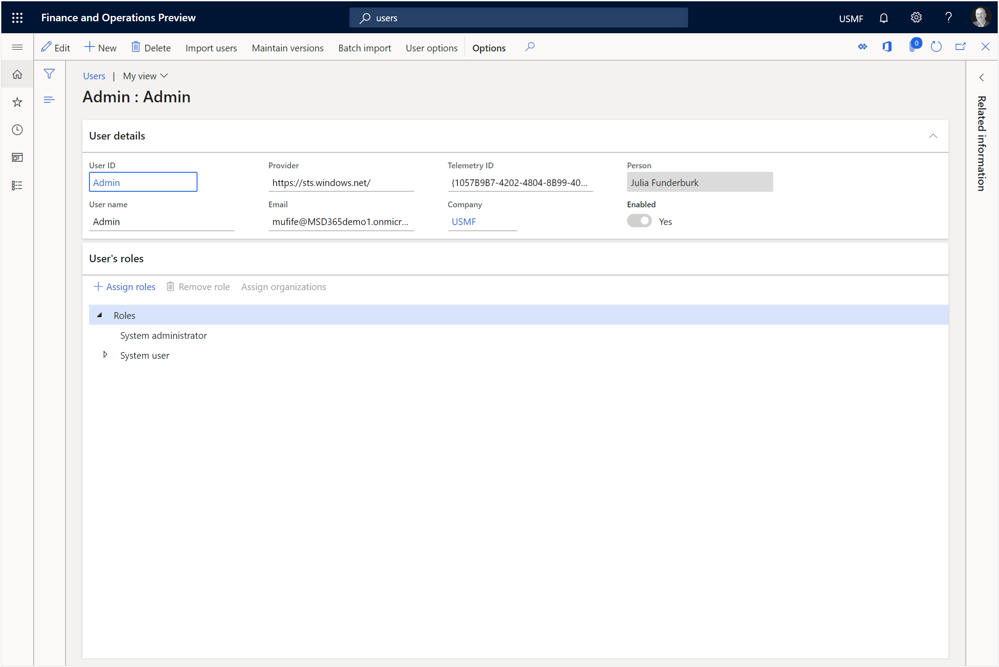

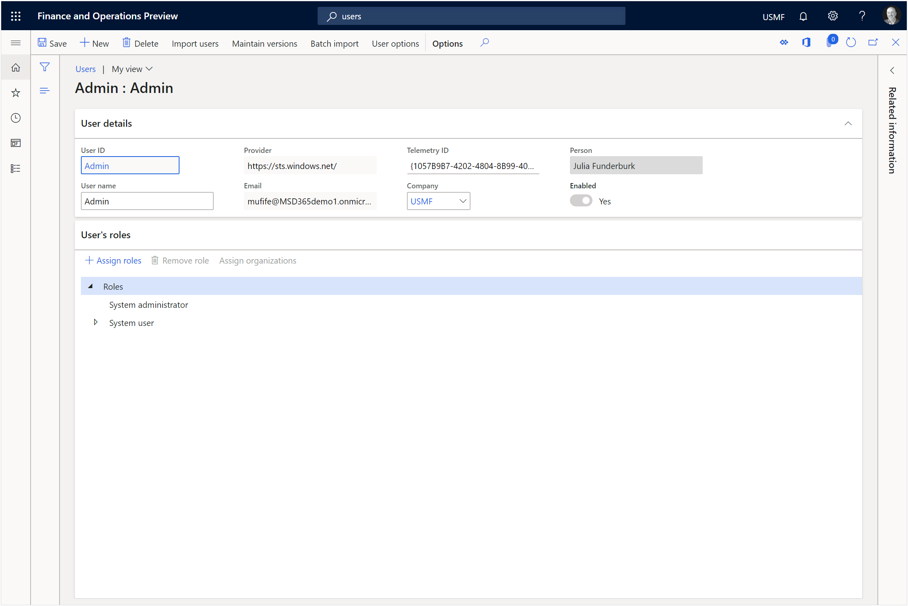

We will start off by updating the Name from Admin to our own user name.
After we have done that we will want to change the worker Name which is set to Julia Funderburk right now.  To do that, click on the Maintain Versions button in the ribbon bar.

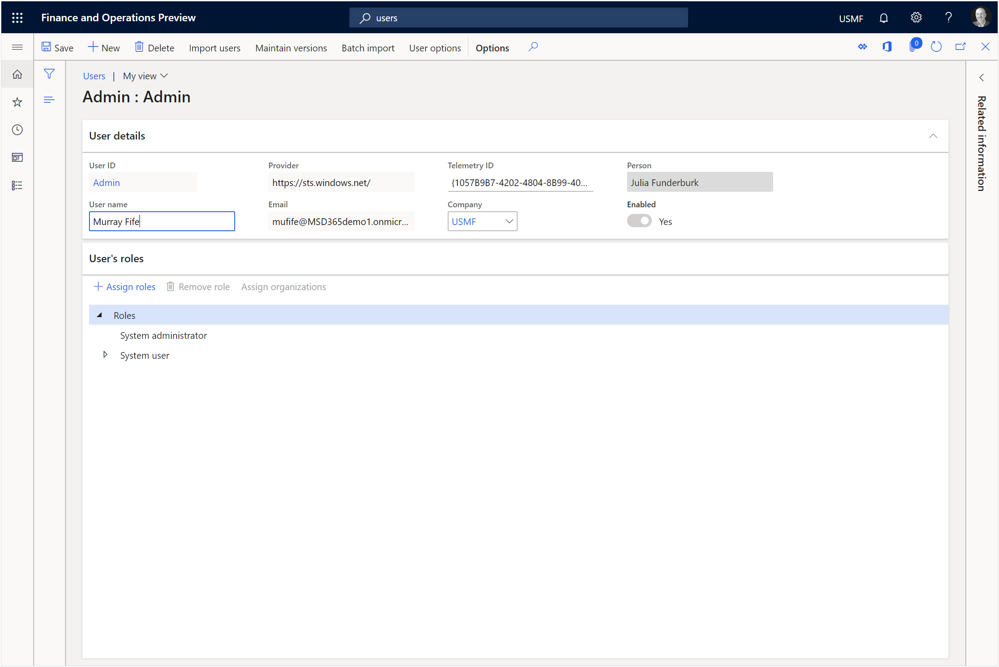

This will open the worker associations where we can see the link to the worker record.  All we need to do here is click on the Delete button.

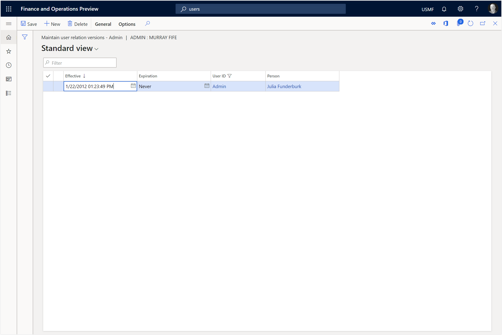

When the confirmation dialog shows up asking if we are sure that we want to delete the worker association, just click on the Yes button.

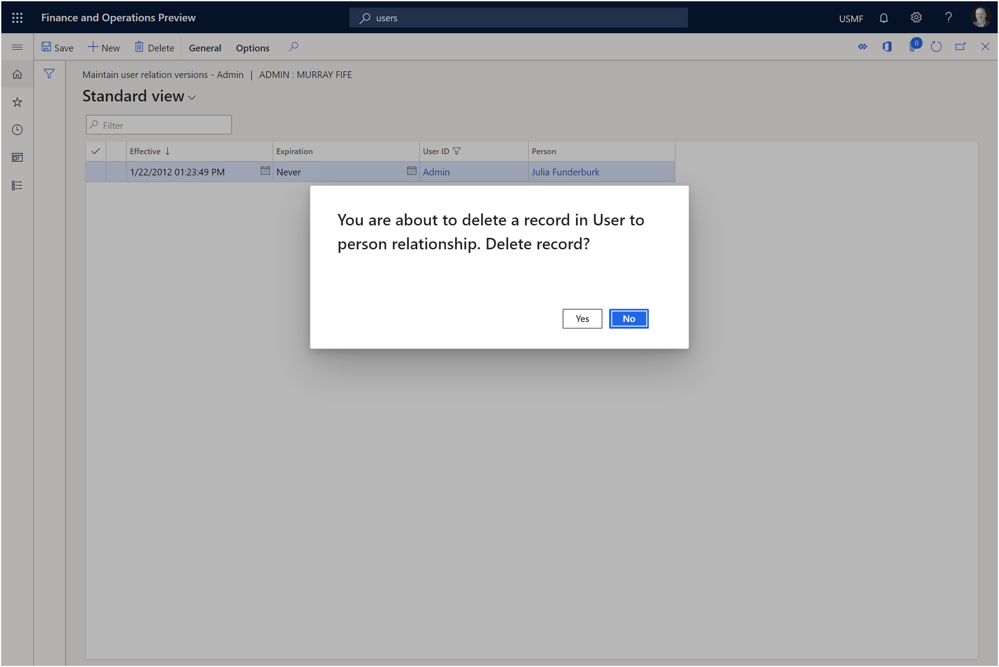

After the record has been deleted, close out of the form.

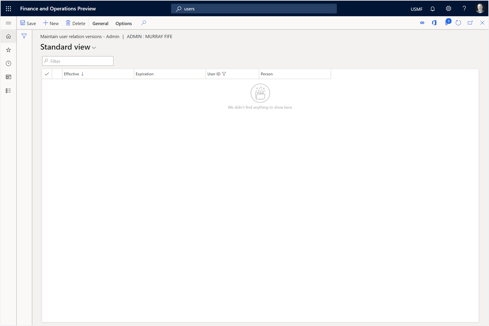

When we return to the worker form the Person will still show that a contact is associated with the user..
All we need to do is refresh the record.
To do this, just click on the refresh button in the menu bar.

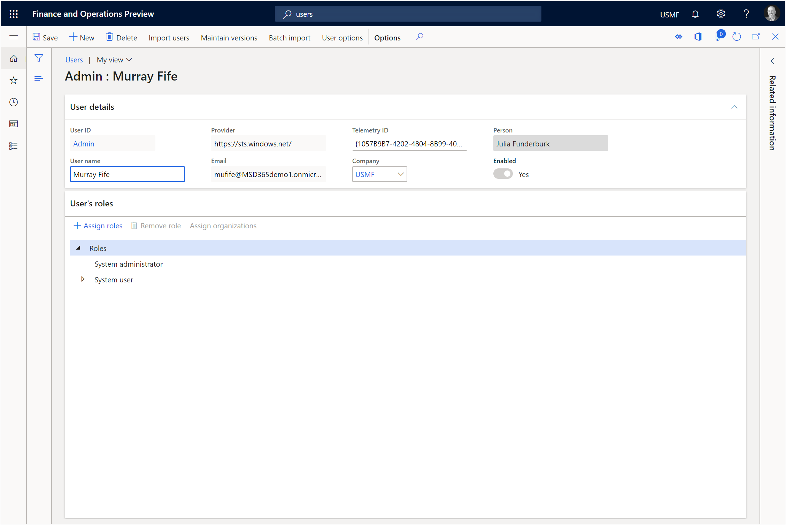

Now we will see that the Name dropdown list is blank and enabled.

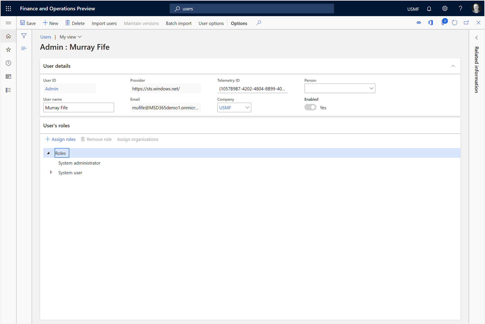

Now we can click on the dropdown list for the Name and find our new worker that we created and click on the Select button to link them with the user.

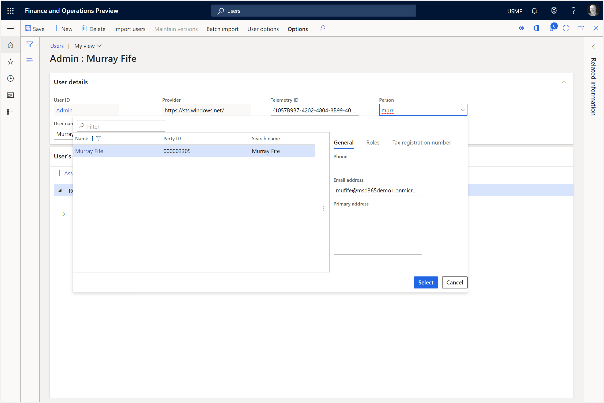

After we have done that, we just need to click on the Save button to commit the change.

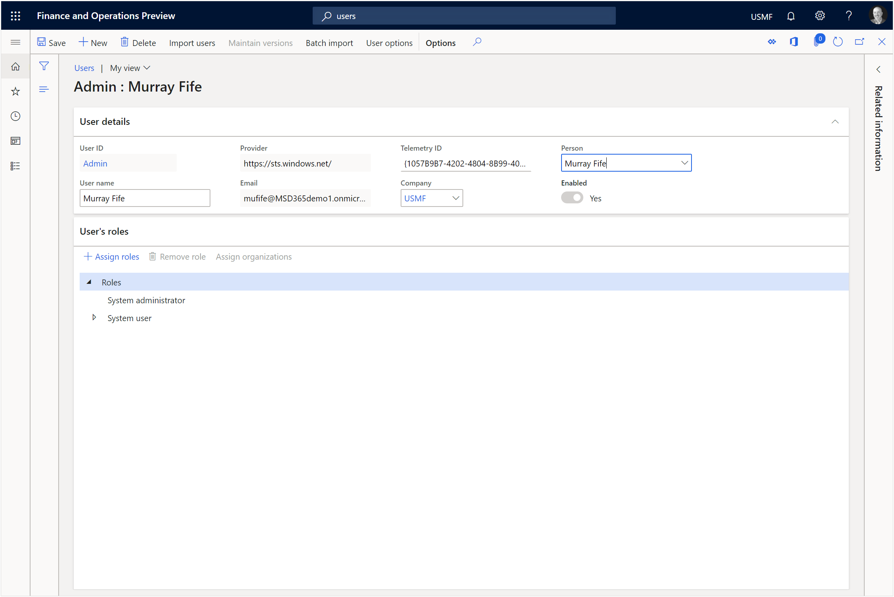

Now our worker is connected to the user account.

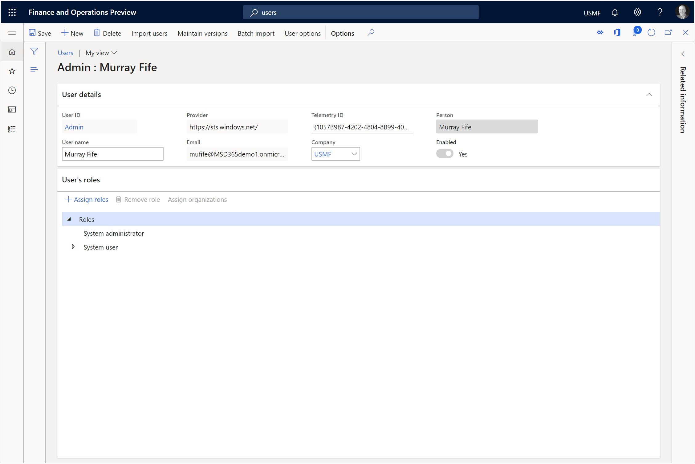

How neat is that.  Now we are definitely making this tenant our own and taking control.

