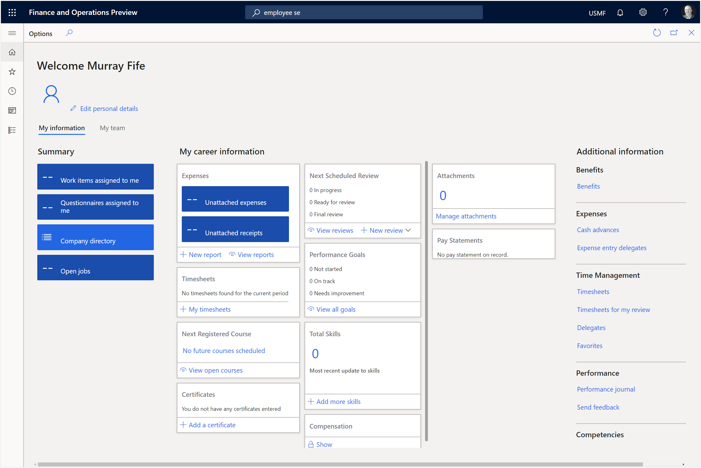

# Viewing the Worker in Employee Self-Service
Now that we have set up our user account and connected it to the worker we will be able to check out our Employee Self Service page.

## How to do it…

To do this type in employee into the search field at the top of the page and Dynamics 365 will show you all of the menu items that match.  All you need to do here is find the Employee self-service menu item and click on it.

This will open the Employee Self Service workspace and we will see that our worker is showing up within our personal information.

How cool is that.  Now we can access all of our information through the Employee Self Service Portal.

