# Updating the Employee Details
Now that we can access the Employee details through the Employee Self Service Workspace we can start tailoring the information that is shown there to make the user a little more interesting.

## How to do it…

Right now there is not a lot of personal information that is showing.  To fix that just click on the Edit Personal Information link underneath the Employee image placeholder.

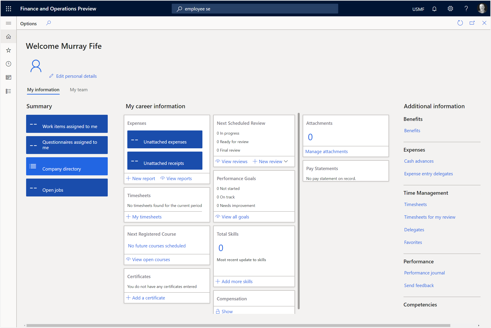

This will open the Personal Information form.  Start off here by clicking on the + Add link within the Addresses tab.

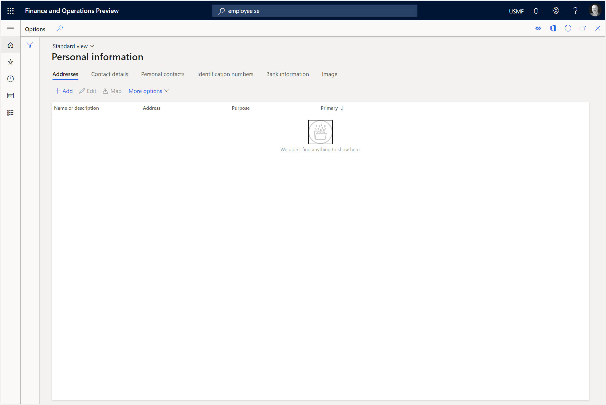

This will open a New Address sidebar for us.

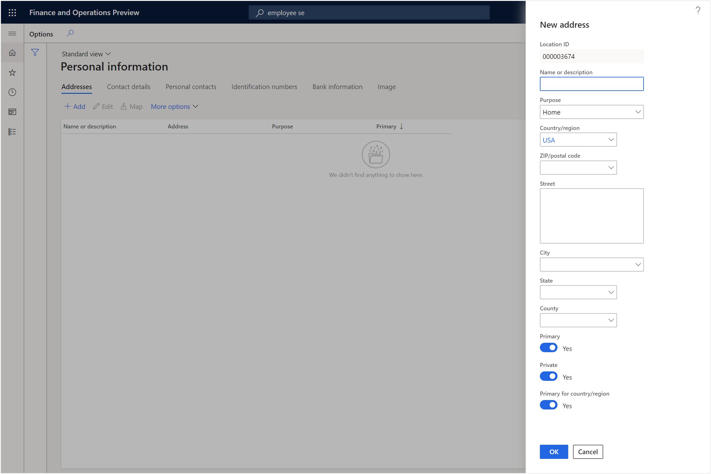

Start off by giving your new address a Name or description.  Here we set it to Office Address.

Next we will select a Purpose for the address.  By default this is set to Home but we will change this to select the Business option.

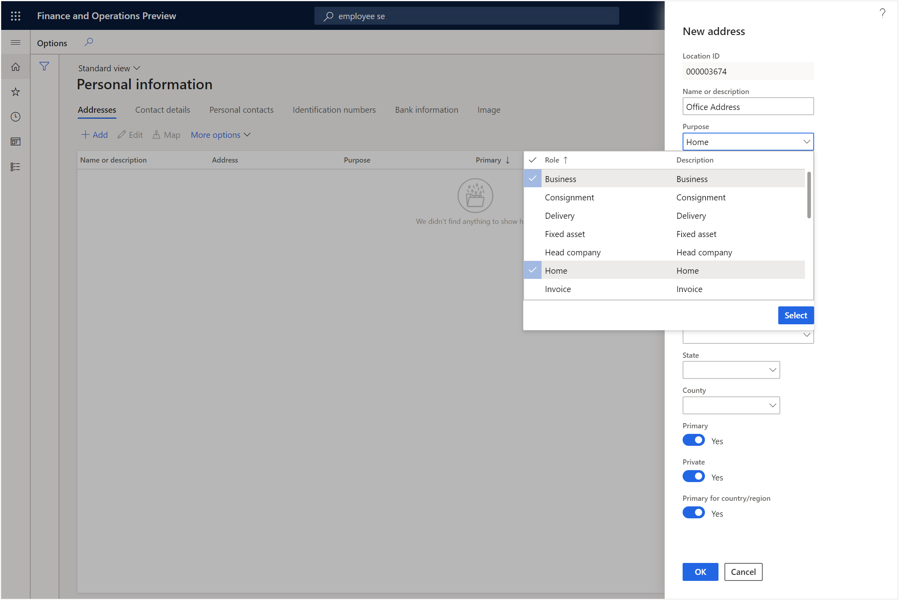

Next enter in the Zip/Postal Code and Dynamics will validate that it is correct.

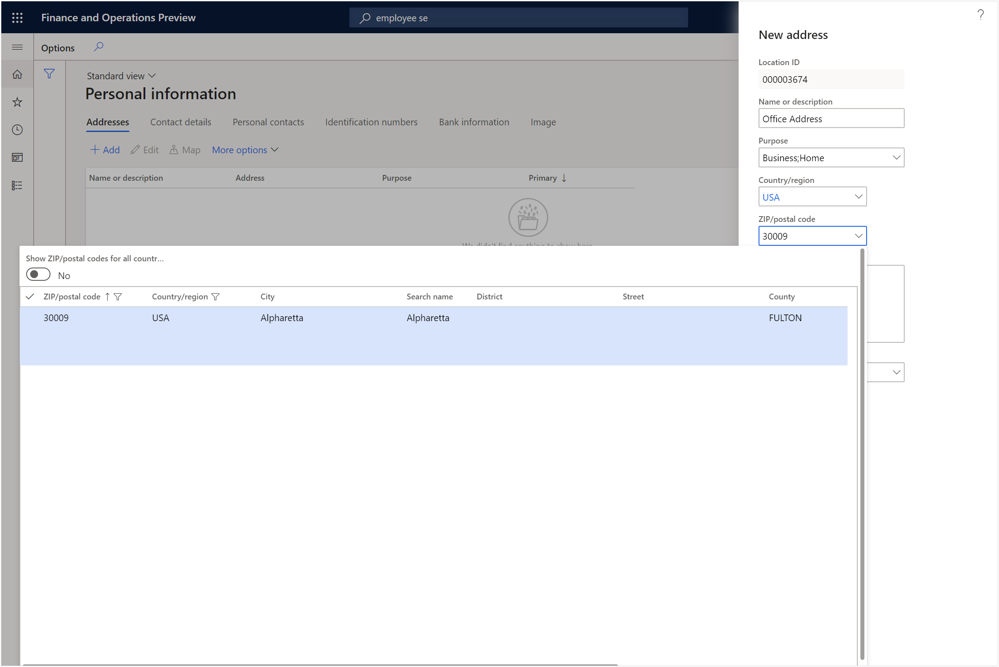

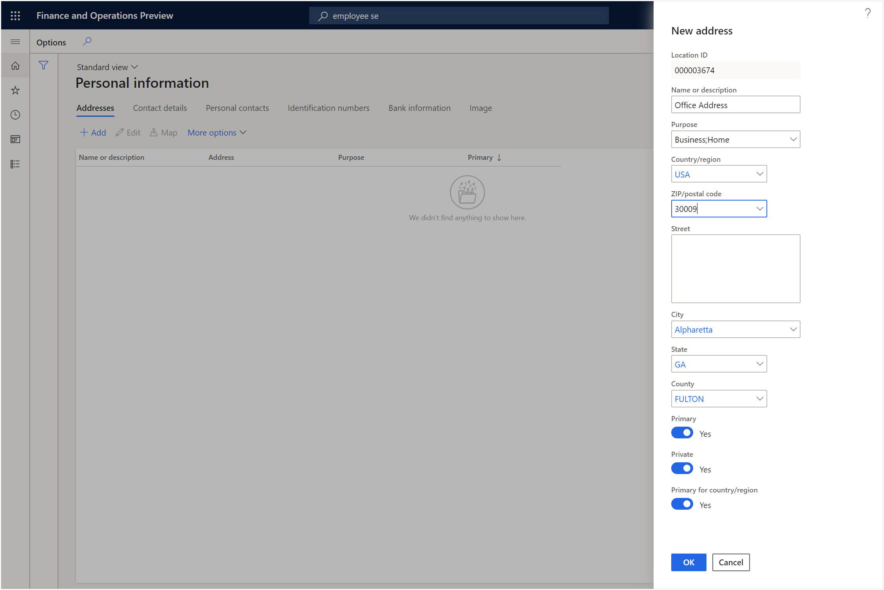

And finally, enter in the Street address.
After you have done that you can click on the Ok button.

Now we have an address associated with our employee record.

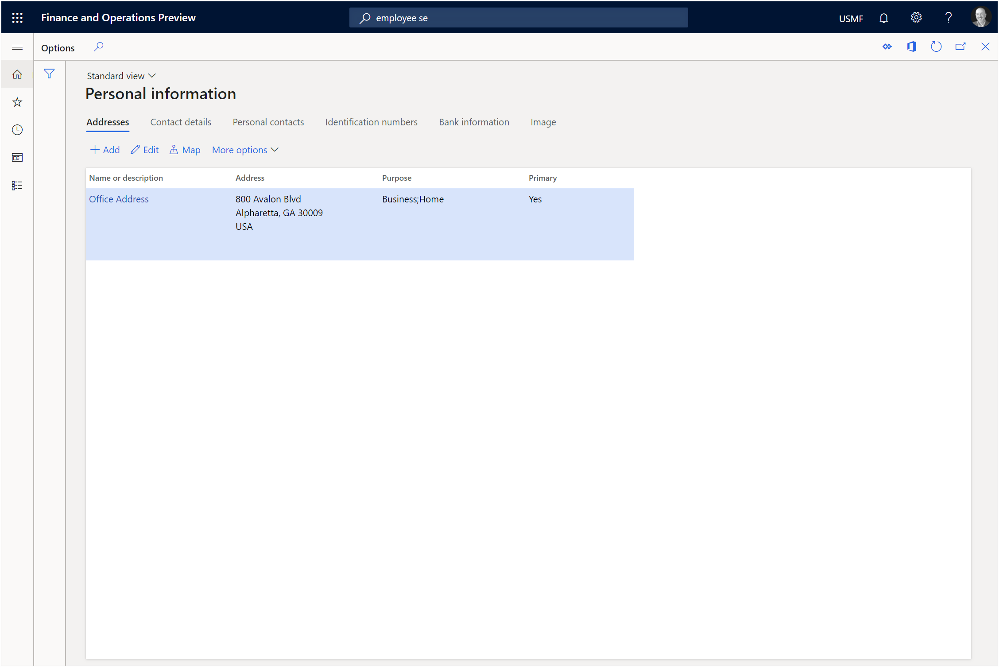

Before we leave we will make one last change and that is to add an employee image to the worker.  To do this switch to the Image tab and then click on the Upload new image burton.

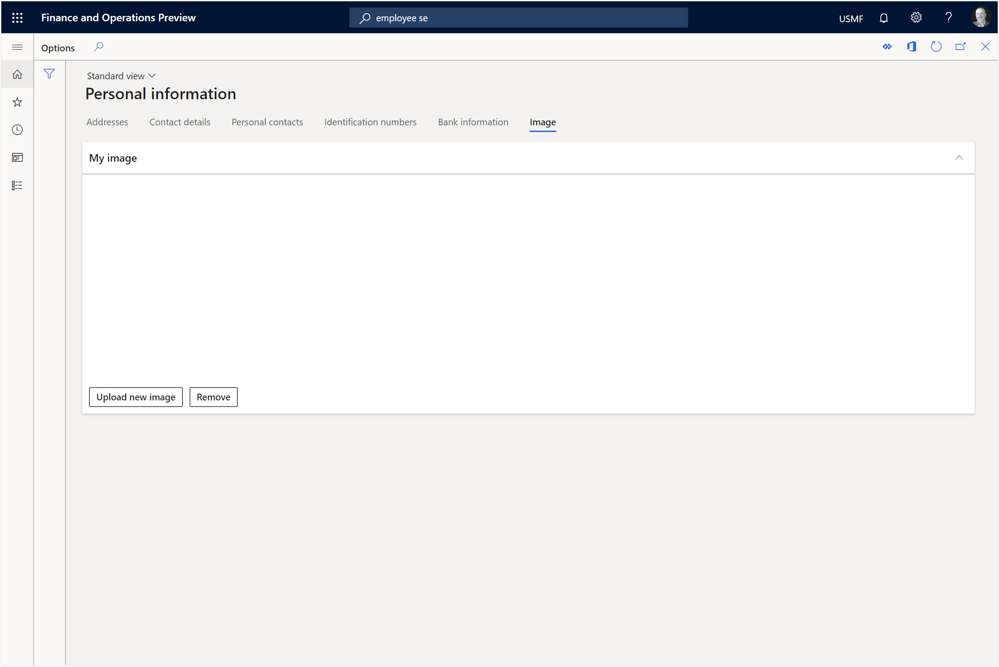

This will open a file browser window and we  can browse to our employee image and then click on the Open button.

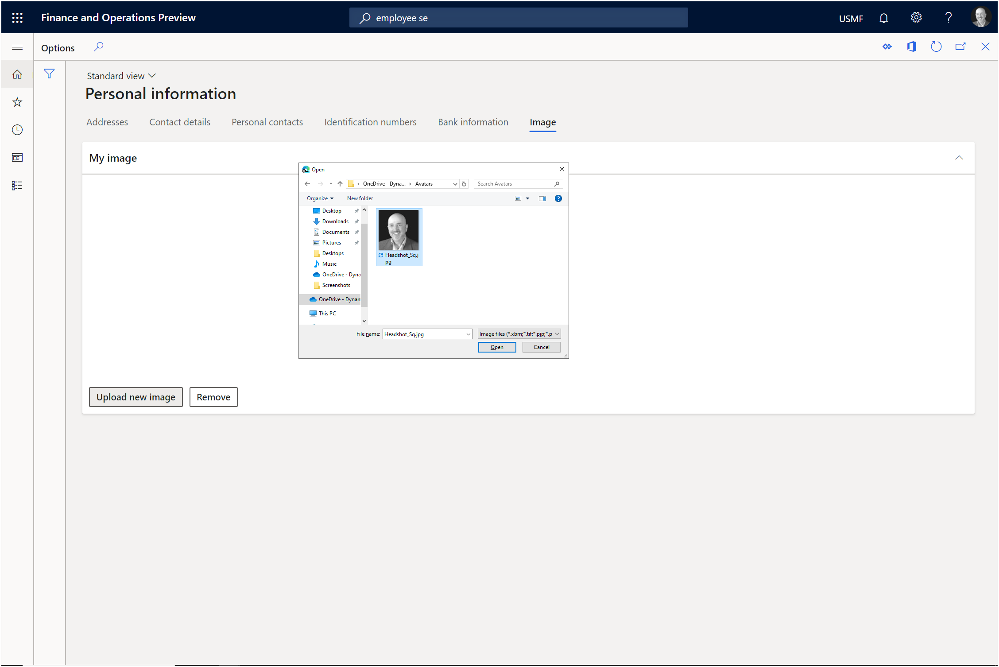

This will upload the image for us and after we have done that we can close out of the Personal Information form.

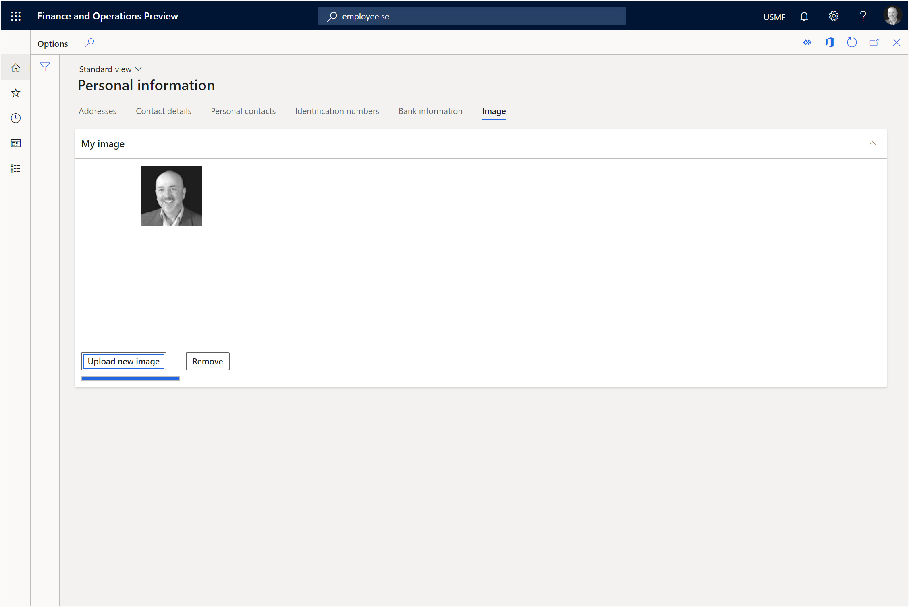

When we return to the Employee Self Service workspace we will see that the image is not showing.
All we need to do here is click on the Refresh icon.

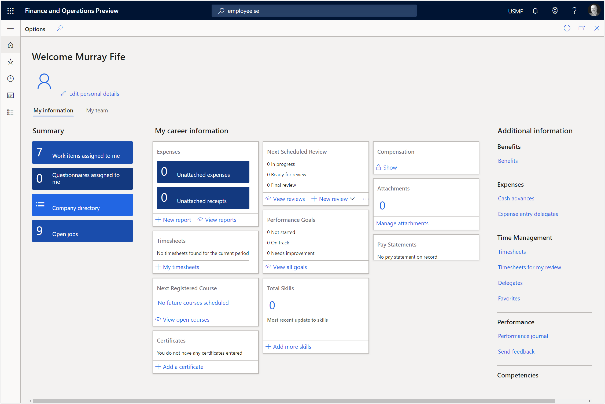

Now when we return to the Employee Self Service workspace and refresh the page we will see out employee image and also the address information.

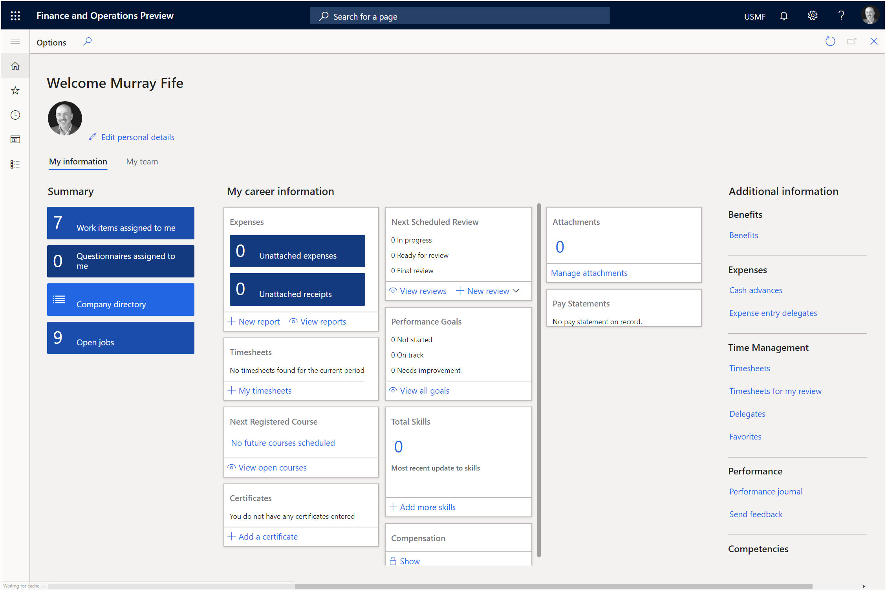

That’s much better.  Now when you see your employee record it looks like an employee.

