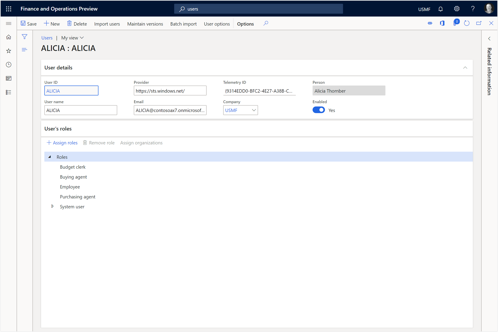

# Updating the Users Login Accounts
When we provision a new demo tenant for Dynamics 365 there are a number of user personas that are already configured within the user accounts.
The problem is that their user names are not connected with our tenant domain, they are set up to log in using a dummy Contoso email account.
So to make these user personas usable we need to do a little bit of housekeeping and update their user information.

## How to do it…

To do this type in users into the search field at the top of the page and Dynamics 365 will show you all of the menu items that match.  All you need to do here is find the System Users menu item and click on it.

This will open the Users list page and all we need to do is select the first user account (other than the Admin user).

This will open the user details page, and we will want to click on the Edit button to switch to edit mode.

Now we will be able to update the user details.

Start off by fixing the Email address for the user so that it uses the tenant email that is associated with the Exchange user.

Although it’s not critical we may also want to update the Name for the user as well.  It just looks tidier.

Then click on the Save button to commit the changes.

Now we want to update the next user account.  Rather than going back to the main list page though we can save a little bit of time by clicking on the List icon on the left hand side and pulling up the list of users alongside the details form.

Now we are able to just select the next user.

and repeat the process.

Note: If the Provider says https://sts.windows-ppe.net/ then you will also want to change it to https://sts.windows.net/.

Now our users will be configured to be used within our demo tenant.

