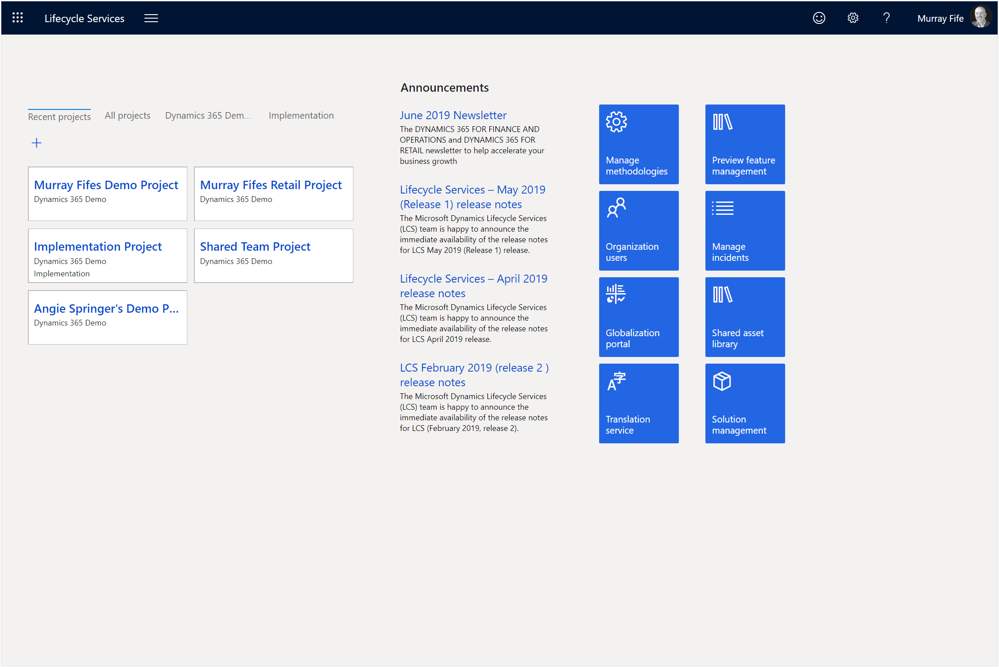
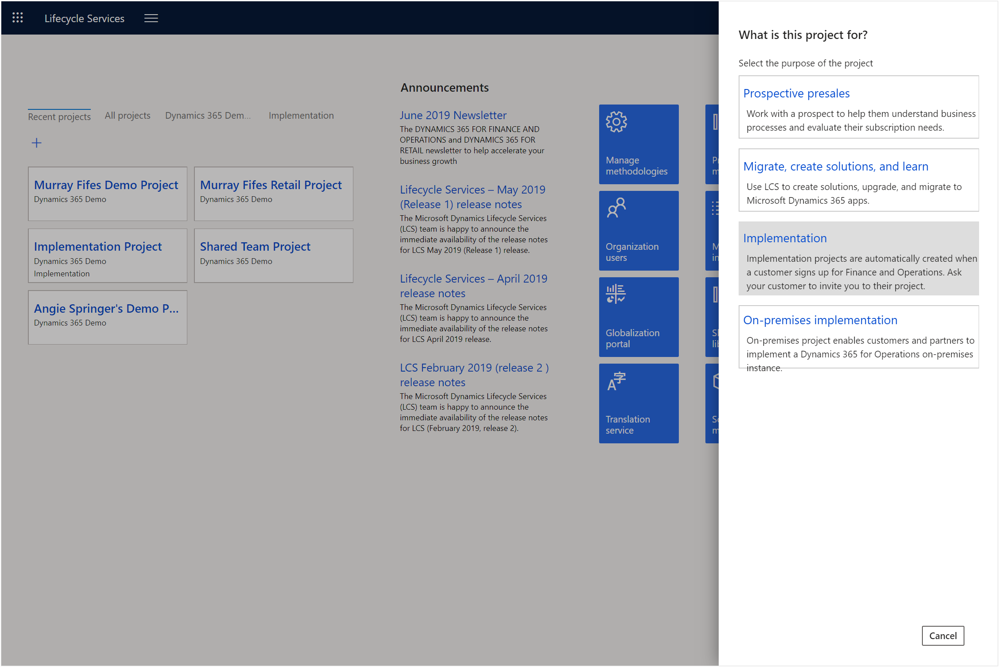
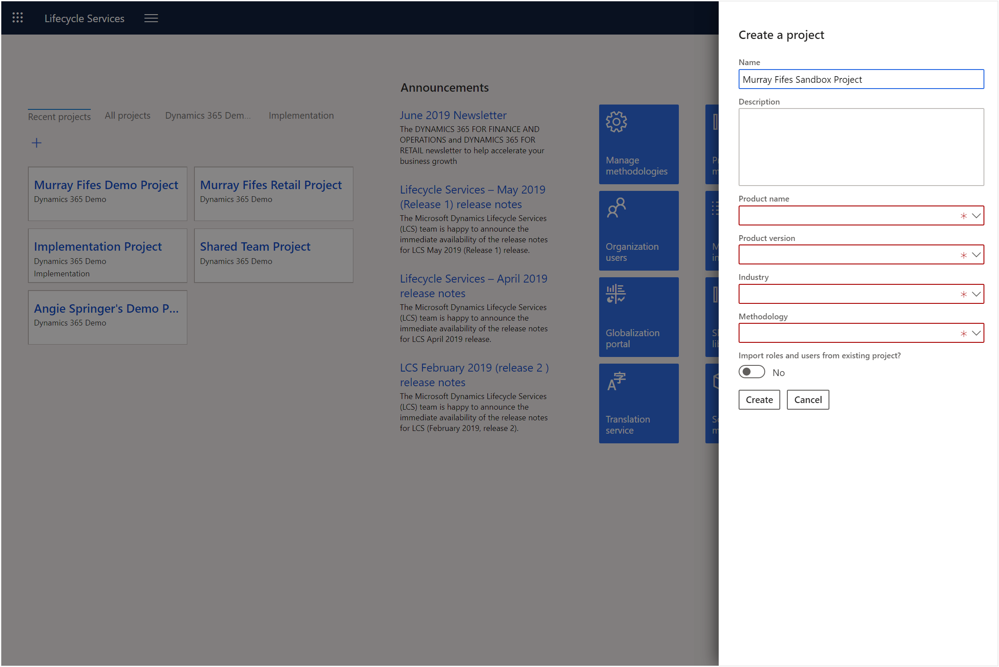
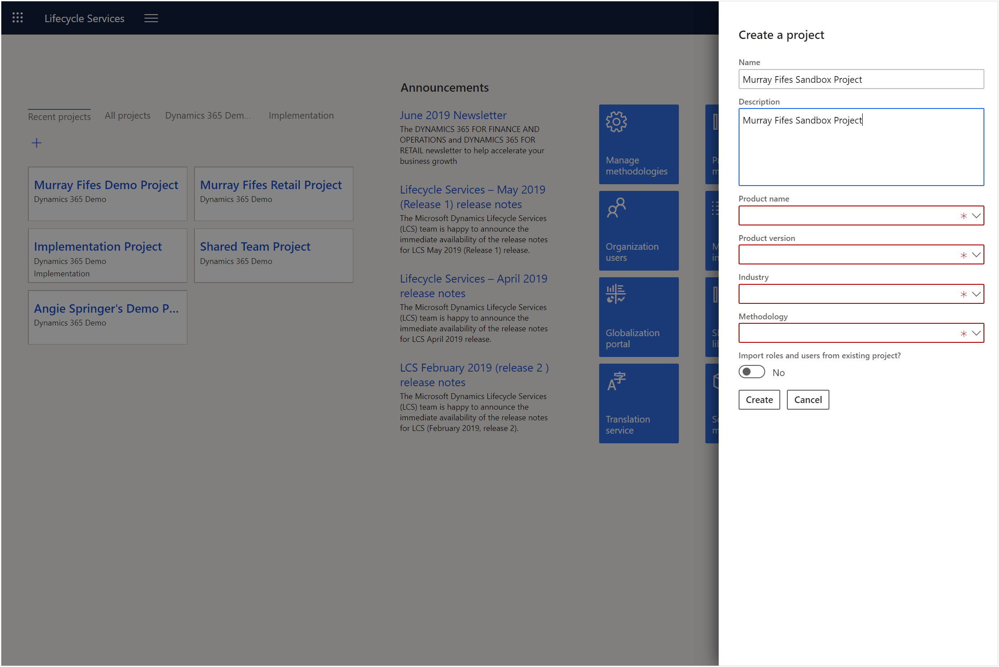
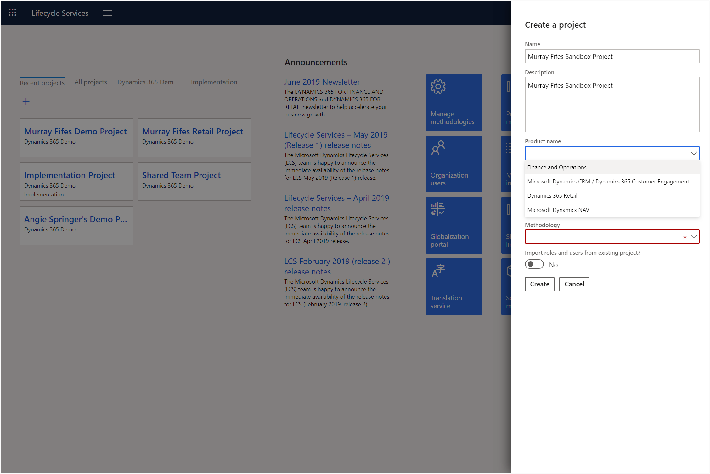
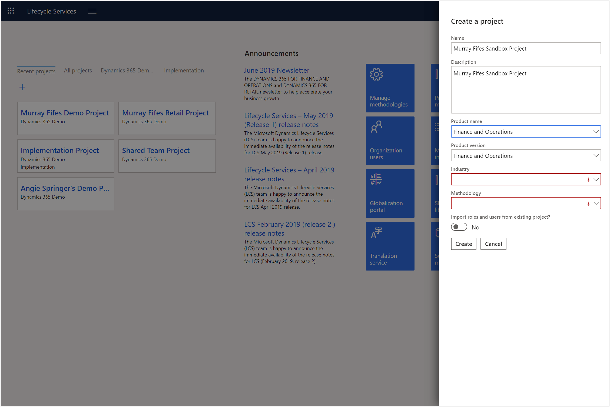
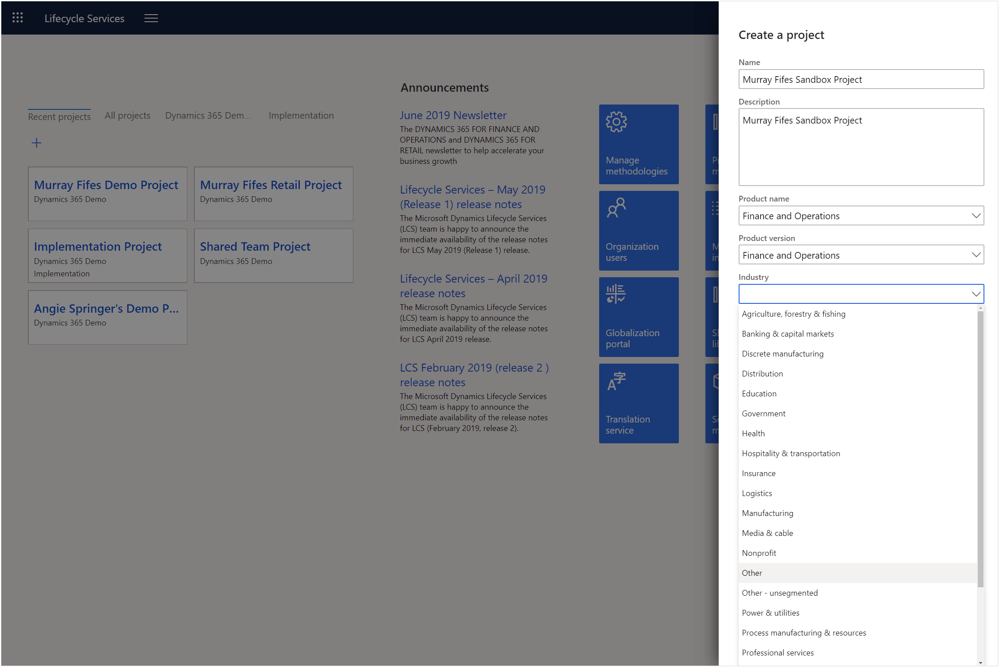
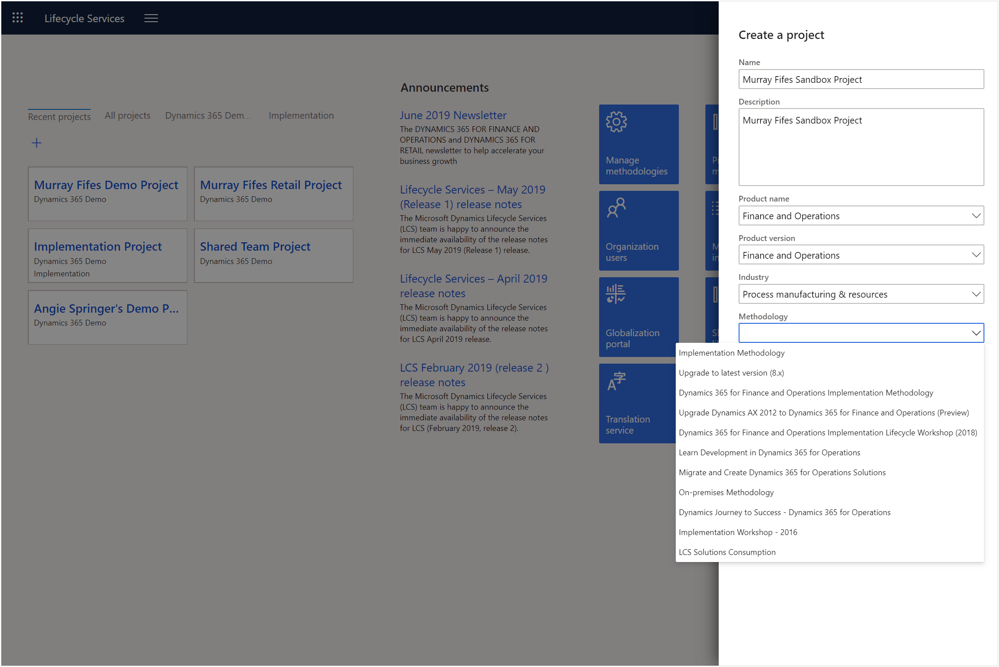
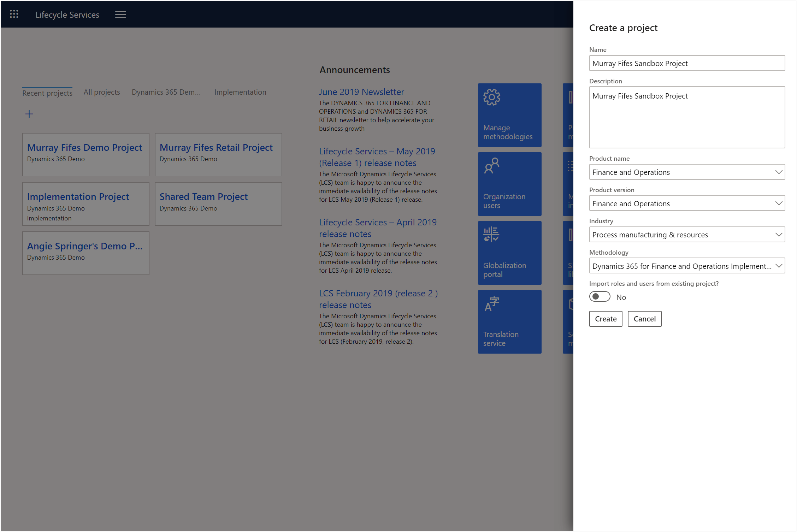
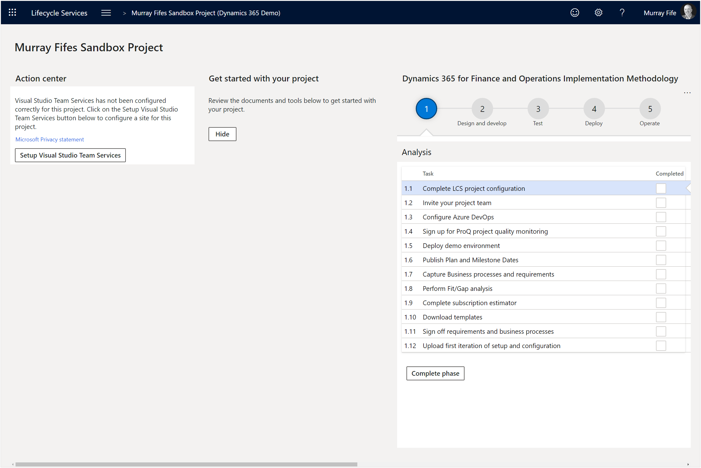

# Creating a new Lifecycle Services Project
If you haven’t created a project within Lifecycle Services yet, then you will need to make that your first task as you start configuring your demonstration environment.

## How to do it…

### Step 1: Navigate to http://lcs.dynamics.com
We will start off by opening the Lifecycle Services portal.
The Lifecycle Service portal landing page will allow us to log into our Lifecycle Services environment.
To do this we will open a browser and navigate to http://lcs.dynamics.com.

### Step 2: Click on the + button
Now that we have accessed the Lifecycle Services (LCS) portal we will see any projects that we have already created, and any projects that we have been invited to join within the Projects section.  We will also see tiles to the right that give us access to tools that we will be able to use to manage our LCS projects.
The Lifecycle Services portal we will see any projects that we have already created, any projects that we have been invited to join, and tools that we will be able to use to manage our projects.
Now we will want to create a new Lifecycle Services project that we will use for our demonstration environment.
To do this just click on the + button within the Projects section of the portal.

### Step 3: Click on the Migrate create solutions and learn button
This will open the What is this project for? dialog box.  This will allow us to select from different LCS project types that we will use as the starting point for our demonstration project.
To do this all we need to do is click on the Migrate create solutions and learn button.

Lifecycle Services will now show us the Create a project dialog box which will allow us to configure the different options for our new LCS project.
The Create a project dialog box will allow us to configure the options for our new project.

### Step 4: Update the Name
Let’s start off by giving our project a unique name to reference it by.
To do this we will just need to update the Name value.
For this example, we set the Name to Murray Fifes Sandbox Project.  You will probably want to use your name, or the client’s name rather than Murray Fife.

### Step 5: Update the Description
Next, we will want to add a description of the project into the form.
To do this just update the Description value.
This time, we to set the Description to Murray Fifes Sandbox Project.  As with the name, you will probably want to substitute the name with your name, of the client project name.

### Step 6: Choose the Product name
Now we will want to select the product that we will want to associate this project with.
There are various options here.  The only ones that we are interested in are the Finance and Operations product, which will allow us to deploy a full Finance & Supply Chain Management environment.  The Dynamics 365 Retail will allow us to create Retail only deployments of Dynamics 365 Retail.
To do this just select the Product name option from the dropdown list.
For this example, we will want to click on the Product name dropdown list and pick Finance and Operations.

This will default in the Product version into the form for us.

### Step 7: Select the Industry
Now we will want to select the industry that this project will be aligned with.
The industry does not really affect any of the configuration settings that will be deployed out to the Lifecycle Services project.
To do this we will just need to select the Industry value from the dropdown list.
For this example, we will want to click on the Industry dropdown list and select Other.

### Step 8: Choose the Methodology
The final choice that we will need to make here is to select the methodology that we will assign to the Lifecycle Services project.
The methodology that we select here will be reflected in the project methodology steps and tasks that will show up within the project when it is deployed out.  We can change these at any time after the deployment, but it’s good to select one of the implementation methodologies because they are the more robust project options.
To do this we will just need to select the Methodology option from the dropdown list.
For this example, we will want to click on the Methodology dropdown list and select Dynamics 365 for Finance and Operations Implementation Methodology.

### Step 9: Click on the Create button
Now that we have selected all the options for our Lifecycle Services project, we can go ahead and create it.
To do this all we need to do is click on the Create button.

## Summary

This will create a new project for us within Lifecycle Services and we will be taken to the new projects landing page
Now we have our very own Lifecycle Services project that we can use to provision our demonstration environments in, and we will also be able to use the assets within Lifecycle Services to support those environments.

